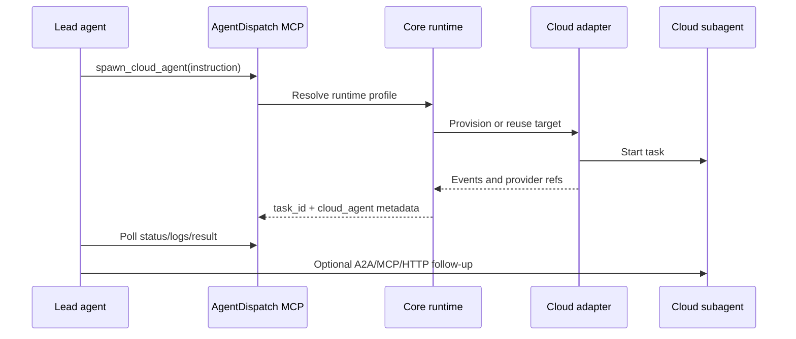

# AgentDispatch

**Spawn cloud subagents from any MCP-capable lead agent.**

AgentDispatch is a provider-neutral control plane for long-running agent work. A local lead agent calls one MCP tool, AgentDispatch starts the right cloud runtime, and the response includes durable task polling plus protocol metadata for native follow-up through A2A, MCP, AG-UI, or HTTP.

V1 targets **AWS Bedrock AgentCore Runtime**. The contract is cloud-neutral from day one so future providers can be added through adapters rather than new tools.

## Why it exists

Local agents are strong planners, but long-running work needs different execution properties:

- Cloud isolation for slow, expensive, or stateful tasks.
- Durable task status when the lead-agent session restarts.
- Standard cloud credential chains instead of raw credentials in tool calls.
- Provider portability across AWS, GCP, Azure, Kubernetes, and local runtimes.
- Native subagent interaction after spawn when the runtime supports it.

## Agent-facing workflow



## Repositories

| Repository | Package | Purpose |
| --- | --- | --- |
| [`core`](https://github.com/agent-dispatch/core) | `@agent-dispatch/core` | Provider-neutral models, adapter contract, routing, and durable task orchestration. |
| [`mcp-server`](https://github.com/agent-dispatch/mcp-server) | `@agent-dispatch/mcp-server` | MCP tools including `spawn_cloud_agent`, status, logs, results, and cancellation. |
| [`adapter-aws-agentcore`](https://github.com/agent-dispatch/adapter-aws-agentcore) | `@agent-dispatch/adapter-aws-agentcore` | AWS AgentCore Runtime adapter for session and runtime modes. |
| [`worker-agentcore`](https://github.com/agent-dispatch/worker-agentcore) | `@agent-dispatch/worker-agentcore` | Reference cloud-side AgentCore worker with A2A-compatible endpoints. |
| [`sdk-js`](https://github.com/agent-dispatch/sdk-js) | `@agent-dispatch/sdk` | TypeScript client for apps, scripts, and agent frameworks. |
| [`cli`](https://github.com/agent-dispatch/cli) | `@agent-dispatch/cli` | Configuration bootstrap, diagnostics, and local smoke tests. |
| [`store-sqlite`](https://github.com/agent-dispatch/store-sqlite) | `@agent-dispatch/store-sqlite` | Local durable task, event, log, artifact, and provider-ref store. |
| [`adapter-template`](https://github.com/agent-dispatch/adapter-template) | `@agent-dispatch/adapter-template` | Template for adding GCP, Azure, Kubernetes, local, or future providers. |
| [`docs`](https://github.com/agent-dispatch/docs) | `@agent-dispatch/docs` | Architecture, quickstarts, provider guides, and operational notes. |
| [`website`](https://github.com/agent-dispatch/website) | `@agent-dispatch/website` | Static website package for the project. |

## Quickstart

```bash
npm install -g @agent-dispatch/cli

agentdispatch init \
  --region us-west-2 \
  --runtime-arn arn:aws:bedrock-agentcore:us-west-2:123456789012:runtime/my-runtime \
  --protocol a2a

agentdispatch doctor
```

Then connect your MCP-capable lead agent to `@agent-dispatch/mcp-server` and ask it to call `spawn_cloud_agent` for work that should leave the local runtime.

## Design principles

- **Stable MCP contract:** new providers should not require new lead-agent tools.
- **Provider isolation:** provider SDKs and provider-specific types stay inside adapter packages.
- **Account profiles:** users configure accounts once; agents reference names.
- **Durable state:** task status, logs, artifacts, provider refs, and cleanup state survive local restarts.
- **Interaction handoff:** the spawn response can include A2A, MCP, AG-UI, or HTTP metadata when the cloud runtime supports native follow-up.
