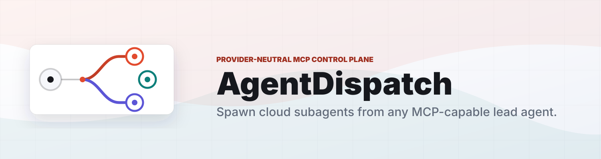

# AgentDispatch

<p align="center">
  
</p>

<p align="center">
  <a href="https://github.com/agent-dispatch/docs/actions/workflows/local-e2e.yml"></a>
  <a href="https://github.com/agent-dispatch/docs/actions/workflows/ci.yml"></a>
  <a href="https://github.com/agent-dispatch/website/actions/workflows/pages.yml"></a>
</p>

> Spawn cloud subagents from any MCP-capable lead agent.

AgentDispatch is the provider-neutral control plane for long-running agent work. A lead agent calls one MCP tool, gets a durable task handle back, and can keep interacting with the spawned cloud subagent through A2A, MCP, AG-UI, or HTTP metadata when the runtime supports it.

## Why It Exists

Local agents are great planners. Long-running work needs different execution properties:

- cloud isolation for expensive, slow, or stateful tasks
- durable status, logs, artifacts, cancellation, and cleanup
- named account profiles instead of raw cloud credentials in prompts
- provider portability across AWS, GCP, Azure, Kubernetes, and local runtimes
- native follow-up with the cloud subagent after spawn

## V1

V1 targets **AWS Bedrock AgentCore Runtime** with a cloud-neutral contract:

```text
provider + capability + task_type + target.mode
```

That means new providers become adapter packages, not new tool names every agent needs to learn.

## Start Here

| Repo | What to read |
| --- | --- |
| [`mcp-server`](https://github.com/agent-dispatch/mcp-server) | MCP tool surface: spawn, preflight, status, logs, results, cancel. |
| [`core`](https://github.com/agent-dispatch/core) | Provider-neutral runtime model and adapter contract. |
| [`adapter-aws-agentcore`](https://github.com/agent-dispatch/adapter-aws-agentcore) | AWS AgentCore Runtime implementation. |
| [`worker-agentcore`](https://github.com/agent-dispatch/worker-agentcore) | Reference cloud-side worker with HTTP and A2A endpoints. |
| [`cli`](https://github.com/agent-dispatch/cli) | Config bootstrap, diagnostics, task dispatch, polling, and A2A follow-up. |
| [`sdk-js`](https://github.com/agent-dispatch/sdk-js) | TypeScript client for apps, scripts, CLIs, and agent frameworks. |
| [`docs`](https://github.com/agent-dispatch/docs) | Architecture, quickstart, adapter guide, and launch checklist. |

For copy-paste lead-agent prompts, use the [Lead agent prompt kit](https://github.com/agent-dispatch/docs/blob/main/docs/lead-agent-prompt-kit.md).

## Verification

- [Verification matrix](https://github.com/agent-dispatch/docs/blob/main/docs/verification-matrix.md) explains what local E2E proves and what still requires live AWS.
- [Live AWS verification](https://github.com/agent-dispatch/docs/blob/main/docs/live-aws-verification.md) is the opt-in runbook for real AgentCore preflight and dispatch evidence.
- The docs repo owns the manual `Live AWS Verification` workflow for producing the JSON evidence artifact when real AWS secrets are configured.

## Quickstart

```bash
npm install -g @agent-dispatch/cli

agentdispatch init \
  --region us-west-2 \
  --runtime-arn arn:aws:bedrock-agentcore:us-west-2:123456789012:runtime/my-runtime \
  --protocol a2a

agentdispatch doctor
```

Then connect your lead agent to `@agent-dispatch/mcp-server` and ask it to call `spawn_cloud_agent` for work that should run outside the local session.

## The Pitch

AgentDispatch makes cloud delegation feel like a normal agent tool call, while preserving the production properties teams need: account boundaries, durable handles, normalized events, cleanup, artifacts, and a path to multiple clouds.

## Contribute

Good first contribution paths are intentionally concrete:

- [Contributor map](https://github.com/agent-dispatch/docs/blob/main/docs/contributor-map.md)
- [New provider adapter](https://github.com/agent-dispatch/.github/issues/new?template=good_first_adapter.yml)
- [Worker framework integration](https://github.com/agent-dispatch/.github/issues/new?template=good_first_worker.yml)
- [Architecture improvement](https://github.com/agent-dispatch/.github/issues/new?template=architecture_request.yml)
